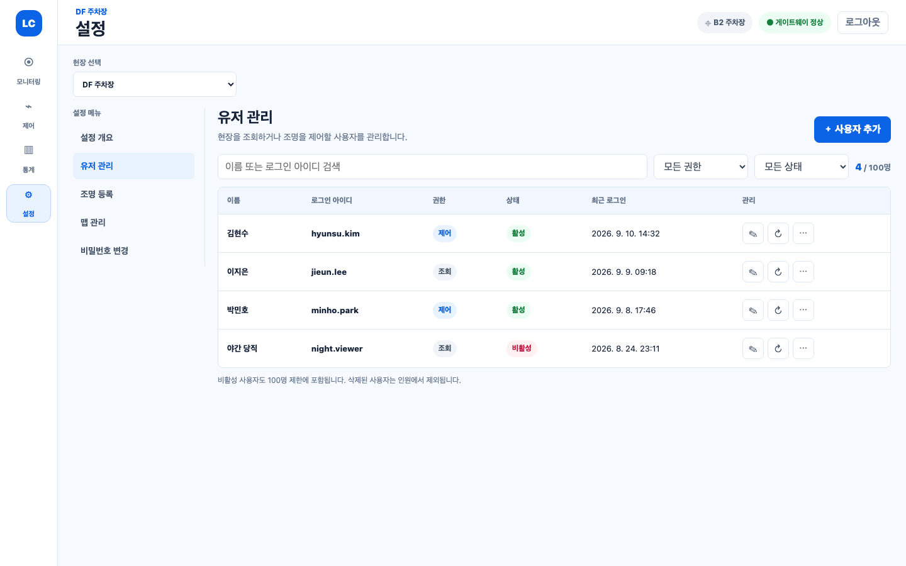
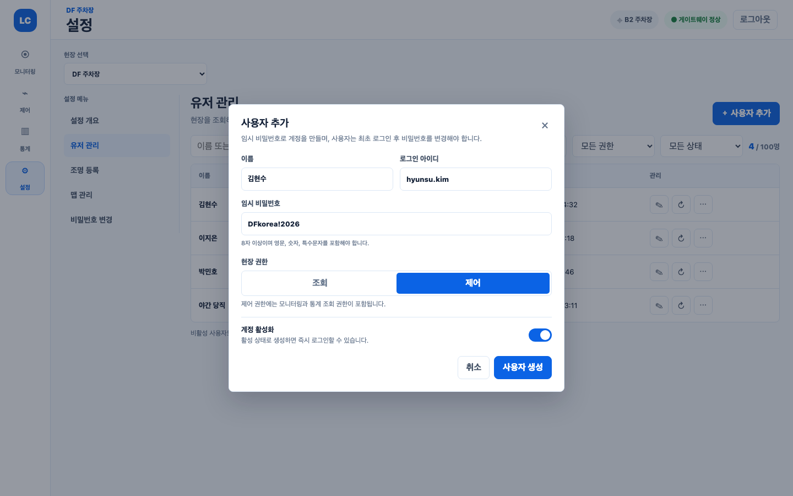
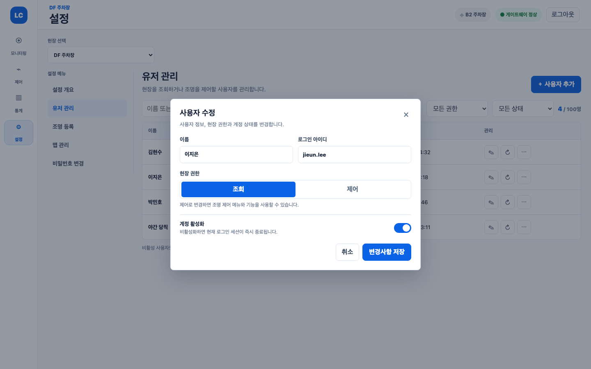
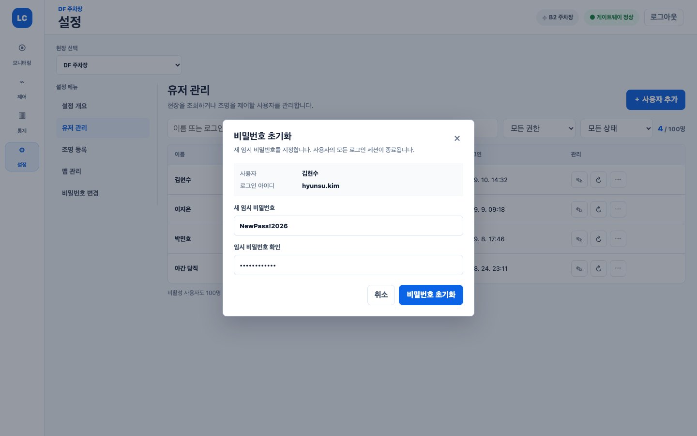
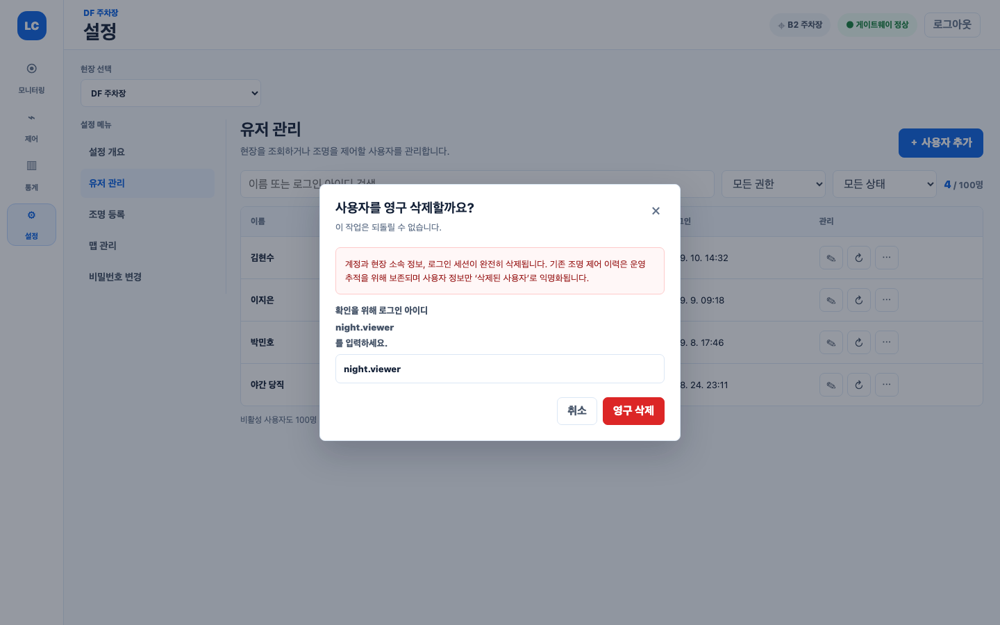
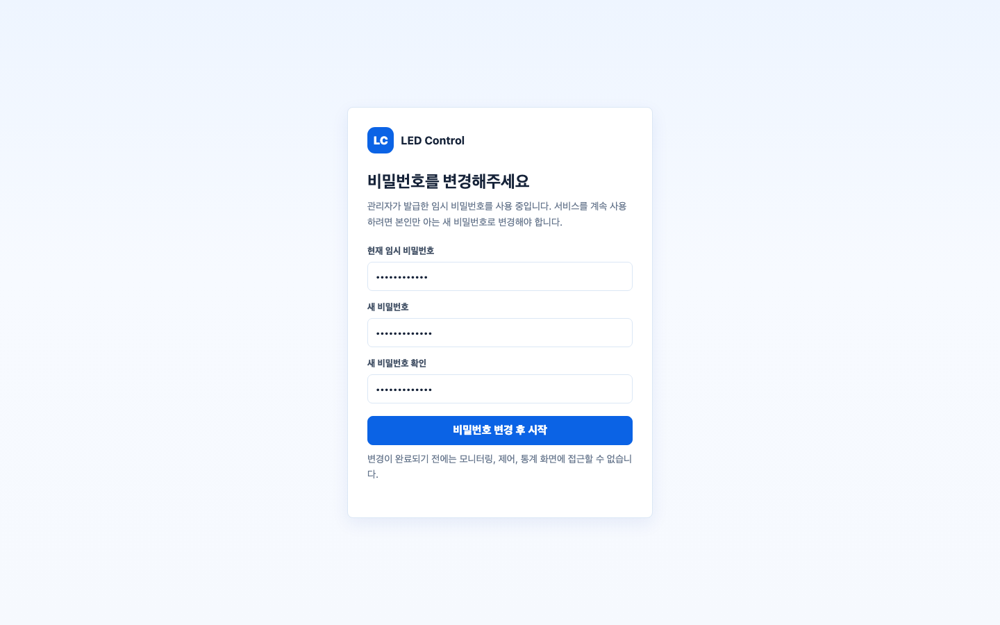

# 현장 유저 관리 및 권한 설계

기준일: 2026-09-10

## 목적과 범위

현장당 한 명인 `admin`이 같은 현장을 사용하는 일반 유저를 직접 생성·조회·수정·비활성화·비밀번호 초기화·영구 삭제할 수 있게 한다. 일반 유저는 모두 기존 `viewer` 역할을 유지하되 현장 소속 정보에 `read` 또는 `control` 접근 수준을 부여한다.

이번 범위는 웹과 백엔드만 포함한다. 모바일, 다중 현장 권한, 사용자 초대 메일, 비밀번호 찾기, 세부 메뉴별 커스텀 권한은 포함하지 않는다.

## 확정한 정책

| 구분 | 정책 |
| --- | --- |
| 관리자 수 | 현장당 `admin` 1명 |
| 일반 유저 수 | 현장당 최대 100명 |
| 일반 유저 역할 | 모두 `viewer` |
| 접근 수준 | `read`, `control` |
| 인원 계산 | 활성·비활성 일반 유저를 포함하고 영구 삭제된 유저는 제외 |
| 권한 범위 | 현장 전체 |
| 비활성화 | 계정과 데이터는 유지하고 모든 세션을 즉시 폐기 |
| 영구 삭제 | 계정·현장 소속·세션을 삭제하고 운영 이력의 사용자 참조는 익명화 |
| 최초 비밀번호 | admin이 임시 비밀번호를 입력하고 사용자가 최초 로그인 후 반드시 변경 |
| 비밀번호 초기화 | admin이 새 임시 비밀번호를 입력하고 모든 세션을 폐기 |

## 권한 모델

`User.role`은 시스템 역할을 표현하고 `SiteMembership.accessLevel`은 현장 내부 기능 권한을 표현한다.

| 사용자 | 모니터링 | 통계 | 수동 제어 | 스케줄·이벤트 관리 | 조명 등록 | 맵 편집 | 유저 관리 |
| --- | --- | --- | --- | --- | --- | --- | --- |
| `admin` | 가능 | 가능 | 가능 | 가능 | 가능 | 가능 | 가능 |
| `viewer + read` | 가능 | 가능 | 불가 | 불가 | 불가 | 읽기 전용 | 불가 |
| `viewer + control` | 가능 | 가능 | 가능 | 불가 | 불가 | 읽기 전용 | 불가 |

- `control`은 `read`를 포함한다.
- 일반 유저에게 `admin` 역할을 부여하지 않는다.
- admin 전용 API와 설정 route는 접근 수준과 관계없이 일반 유저에게 허용하지 않는다.
- 프론트의 메뉴 숨김은 편의 기능이며 최종 권한 검사는 API transaction 안에서 수행한다.
- 존재하지만 접근할 수 없는 현장은 정보 노출을 피하기 위해 `404`, 읽기는 가능하지만 기능 권한이 부족한 경우는 `403`으로 응답한다.

## 데이터 모델

### 신규 필드와 enum

```prisma
enum SiteAccessLevel {
  read
  control
}

model User {
  mustChangePassword Boolean @default(false)
}

model SiteMembership {
  accessLevel SiteAccessLevel @default(read)
}
```

기존 `SiteMembership`은 migration에서 전부 `read`로 보정한다. 기존 operator와 admin, 초대 가입 사용자는 `mustChangePassword = false`를 유지한다.

### 영구 삭제를 위한 이력 참조 변경

- `Command.requestedBy`를 nullable로 바꾸고 `User` 삭제 시 `SetNull`을 적용한다.
- `ManualOverride.requestedById`를 nullable로 바꾸고 `User` 삭제 시 `SetNull`을 적용한다.
- `ManualOverride.command` 관계는 전역 unique인 `commandId`만 참조하도록 단순화한다.
- `Session.user`는 `Cascade`를 적용해 사용자 삭제와 동시에 세션을 제거한다.
- 조명 명령, 장비 응답, 수동 override, 자동화 실행 이력은 유지한다.
- 화면과 API는 nullable 사용자 참조를 `삭제된 사용자`로 표현한다.
- 일반 유저에게 허용되지 않는 provisioning, 맵 revision, 스케줄·이벤트 작성 관계는 변경하지 않는다.

## API 설계

### 유저 관리 API

| Method | Path | 설명 |
| --- | --- | --- |
| `GET` | `/sites/:siteId/users` | 일반 유저 목록과 `count`, `limit=100` 조회 |
| `POST` | `/sites/:siteId/users` | 일반 유저 생성 |
| `PATCH` | `/sites/:siteId/users/:userId` | 이름·로그인 아이디·접근 수준·상태 수정 |
| `POST` | `/sites/:siteId/users/:userId/reset-password` | 새 임시 비밀번호 설정 |
| `DELETE` | `/sites/:siteId/users/:userId` | 로그인 아이디 재입력 후 영구 삭제 |

목록 응답 항목은 `id`, `name`, `loginId`, `accessLevel`, `status`, `lastLoginAt`, `createdAt`, `updatedAt`만 포함한다. 비밀번호와 비밀번호 hash는 어떤 응답에도 포함하지 않는다.

생성 요청은 `name`, `loginId`, `temporaryPassword`, `accessLevel`, `status`를 받는다. 수정 요청은 `name`, `loginId`, `accessLevel`, `status`, `expectedUpdatedAt`을 받아 동시 수정 충돌을 `409`로 처리한다. 삭제 요청은 body의 `confirmationLoginId`가 현재 로그인 아이디와 일치해야 한다.

### transaction과 경쟁 조건

- 생성은 Serializable transaction 안에서 Site 행을 `FOR UPDATE`로 잠근 뒤 admin 배정 상태를 재확인하고 현재 일반 유저 수를 계산한다.
- 100명인 경우 `409 USER_LIMIT_REACHED`로 거절한다.
- 수정·비활성화·초기화·삭제는 Site 행, 대상 User 행 순서로 잠근다.
- 대상은 동일 고객사·동일 현장 membership을 가진 `viewer`만 허용한다.
- admin 자신, 다른 현장 사용자, operator는 대상이 될 수 없다.
- 활성 계정의 비활성화·비밀번호 초기화는 같은 transaction에서 모든 세션을 폐기한다.
- 영구 삭제 감사 로그에는 삭제 대상의 이름, 로그인 아이디, 사용자 ID를 저장하지 않는다.

### 오류 코드

| HTTP | code | UI 처리 |
| --- | --- | --- |
| `400` | `INVALID_INPUT` | 해당 입력 필드 오류 표시 |
| `404` | `SITE_USER_NOT_FOUND` | 목록 갱신 후 대상이 사라졌음을 안내 |
| `409` | `LOGIN_ID_ALREADY_EXISTS` | 로그인 아이디 입력 필드에 표시 |
| `409` | `USER_LIMIT_REACHED` | 생성 버튼을 비활성화하고 100명 제한 안내 |
| `409` | `SITE_USER_CHANGED` | 최신 정보 재조회 후 다시 수정하도록 안내 |
| `403` | `SITE_CAPABILITY_DENIED` | 권한 변경 안내 후 접근 화면에서 이동 |

## 인증과 최초 로그인

- admin이 만든 일반 유저와 비밀번호를 초기화한 유저는 `mustChangePassword = true`가 된다.
- 로그인과 `/auth/me` 응답에는 `mustChangePassword`를 포함한다.
- `SessionAuthGuard`는 강제 변경 대상의 일반 API 호출을 `403 PASSWORD_CHANGE_REQUIRED`로 막는다.
- `/auth/me`, `/auth/change-password`, `/auth/logout`만 강제 변경 상태에서도 허용한다.
- 비밀번호 변경 성공 시 `mustChangePassword = false`로 바꾸고 현재 세션을 제외한 나머지 세션을 폐기한다.
- 웹은 로그인 직후 일반 shell을 만들기 전에 전용 비밀번호 변경 화면을 렌더링한다.
- 모든 활성 고객 사용자는 설정에서 본인 비밀번호를 변경할 수 있다.

## 현장 capability 계약

Dashboard 응답에 다음 권한을 포함해 프론트가 역할 문자열을 다시 해석하지 않게 한다.

```ts
interface SiteCapabilities {
  read: true;
  control: boolean;
  manage: boolean;
  commission: boolean;
}
```

- admin은 네 capability가 모두 `true`다.
- `read` 일반 유저는 `read`만 `true`다.
- `control` 일반 유저는 `read`, `control`이 `true`다.
- 수동 명령 생성·취소는 transaction 내부의 `control` 검사를 사용한다.
- 스케줄, 차량 이벤트, 그룹 관리, 설치, 조명 등록, 맵 편집은 기존 `manage` 또는 `commission` 검사를 유지한다.

## 웹 UI 설계

### 설정 메뉴

admin의 설정 메뉴는 `설정 개요 → 유저 관리 → 조명 등록 → 맵 관리 → 비밀번호 변경` 순서다. 일반 유저는 `설정 개요 → 맵 관리(읽기 전용) → 비밀번호 변경`만 볼 수 있다.

`/settings/users`는 admin 전용이다. 일반 유저가 직접 URL을 입력하면 `/settings`로 replace 이동하며 API에서도 다시 차단한다.

### 유저 목록

- 이름, 로그인 아이디, 권한, 상태, 최근 로그인, 관리 열을 표시한다.
- 이름·로그인 아이디 검색과 권한·상태 필터를 제공한다.
- 우측 상단에 `현재 인원 / 100명`을 표시한다.
- 비활성 사용자도 목록과 인원에 포함한다.
- 행 동작은 수정, 비밀번호 초기화, 활성/비활성 전환, 영구 삭제다.
- 서버 응답이 없을 때는 기존 목록을 유지하면서 재시도 가능한 오류를 표시한다.



### 생성과 수정

생성 dialog는 이름, 로그인 아이디, 임시 비밀번호, 조회/제어 segmented control, 활성 상태를 받는다. 생성 성공 후 평문 비밀번호를 다시 표시하지 않고 목록을 갱신한다.



수정 dialog는 현재 데이터를 채워 열고 비밀번호를 다루지 않는다. 권한과 상태 변경의 효과를 입력 옆에서 설명한다.



### 비밀번호 초기화와 삭제

비밀번호 초기화는 새 임시 비밀번호와 확인값을 받는다. 성공 시 기존 세션 종료와 다음 로그인 강제 변경을 안내한다.



영구 삭제는 영향을 설명하고 대상 로그인 아이디를 정확히 다시 입력해야 버튼이 활성화된다. 비활성화는 별도 행 동작으로 유지해 일시적인 접근 중단에 사용한다.



### 최초 로그인 비밀번호 변경

강제 변경 화면은 일반 메뉴를 렌더링하지 않는다. 현재 임시 비밀번호, 새 비밀번호, 확인값을 입력하고 성공하면 모니터링으로 이동한다. 로그아웃은 항상 가능해야 한다.



### 제어 메뉴 노출

- `read` 사용자는 좌측 주 메뉴에서 제어를 보지 못하고 `/control` 직접 접근도 모니터링으로 이동한다.
- `control` 사용자는 제어 메뉴에서 수동 제어만 사용한다.
- 일반 유저에게 스케줄, 이벤트, 구역 관리 UI는 보이지 않는다.
- admin은 기존 제어 기능 전체를 유지한다.

## 보안 원칙

- loginId는 기존 `normalizeLoginId` 규칙으로 정규화하고 전역 unique를 유지한다.
- 비밀번호 정책과 scrypt hash 구현은 기존 `PasswordService`를 재사용한다.
- 평문 비밀번호는 DB, 로그, 감사 로그, API 응답, React Query cache에 저장하지 않는다.
- 목록 API는 password 관련 column을 select하지 않는다.
- 비활성화와 비밀번호 초기화는 요청 완료 전에 세션 폐기를 끝낸다.
- UI 권한 상태가 오래되었더라도 API transaction 재인가가 최종 결정을 내린다.

## 테스트 전략

### DB·API

- 기존 membership이 `read`로 migration되는지 검증한다.
- active와 disabled 합계가 100명일 때 동시 생성 요청 중 하나만 성공하는지 검증한다.
- admin의 동일 현장 viewer CRUD, 비활성화, 재활성화, 비밀번호 초기화를 검증한다.
- 타 현장 admin, 일반 유저, operator의 유저 관리 접근을 차단한다.
- hard delete 후 User, membership, session이 사라지고 Command와 ManualOverride가 익명화되어 남는지 검증한다.
- 강제 비밀번호 변경 전 허용 endpoint 3개 외의 API가 차단되는지 검증한다.
- `read`는 명령이 거절되고 `control`은 수동 명령 생성·취소가 가능한지 검증한다.
- 일반 유저의 스케줄·이벤트·그룹·등록·맵 편집은 계속 거절되는지 회귀 검증한다.

### Web

- admin 설정 메뉴와 유저 관리 CRUD dialog를 단위 테스트한다.
- 100명 제한, 중복 아이디, 충돌, 삭제 확인 입력, 서버 오류 상태를 검증한다.
- read/control/admin별 주 메뉴와 직접 route 접근을 검증한다.
- 최초 로그인 강제 비밀번호 변경과 성공 후 tenant cache 갱신을 검증한다.
- 비활성화된 현재 사용자의 다음 요청과 재로그인이 실패하는지 실제 API E2E로 검증한다.

## 완료 조건

1. admin이 현장 일반 유저를 최대 100명까지 생성하고 관리할 수 있다.
2. 조회 유저와 제어 유저의 메뉴 및 API 권한이 일치한다.
3. 임시 비밀번호 사용자는 변경 완료 전 다른 기능을 사용할 수 없다.
4. 비활성화, 초기화, 영구 삭제 시 세션과 운영 이력이 정책대로 처리된다.
5. 비밀번호 또는 삭제 대상 PII가 응답·로그·cache에 남지 않는다.
6. API 단위·통합 테스트, Web 단위 테스트, 타입 검사, 빌드와 핵심 Playwright E2E가 통과한다.

## 관련 시안

- 수정 가능한 원본: `docs/assets/user-management-ui/user-management-mockup.html`
- 렌더링 결과: `docs/assets/user-management-ui/rendered/`

