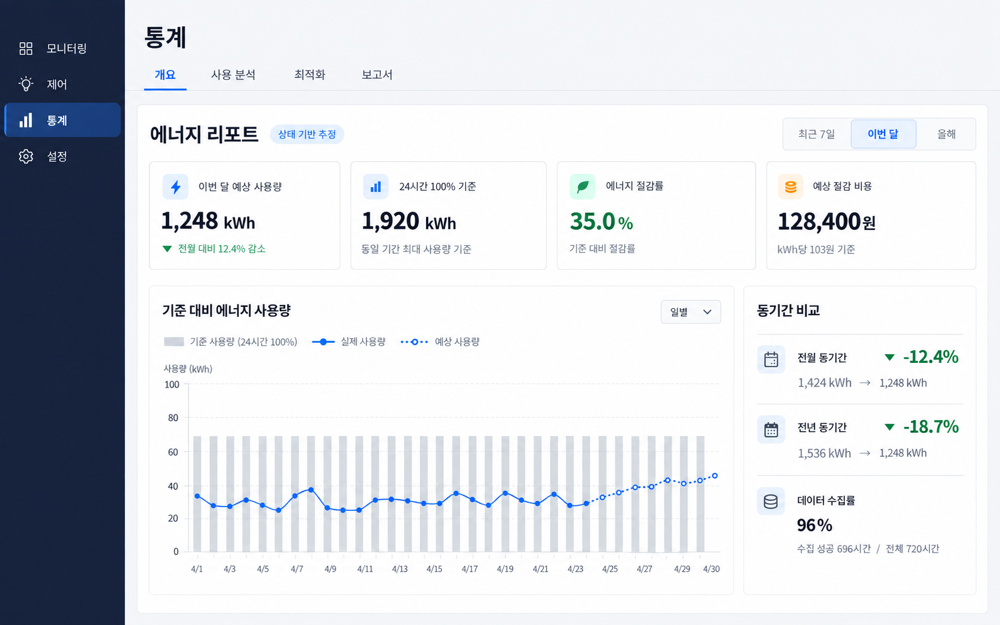
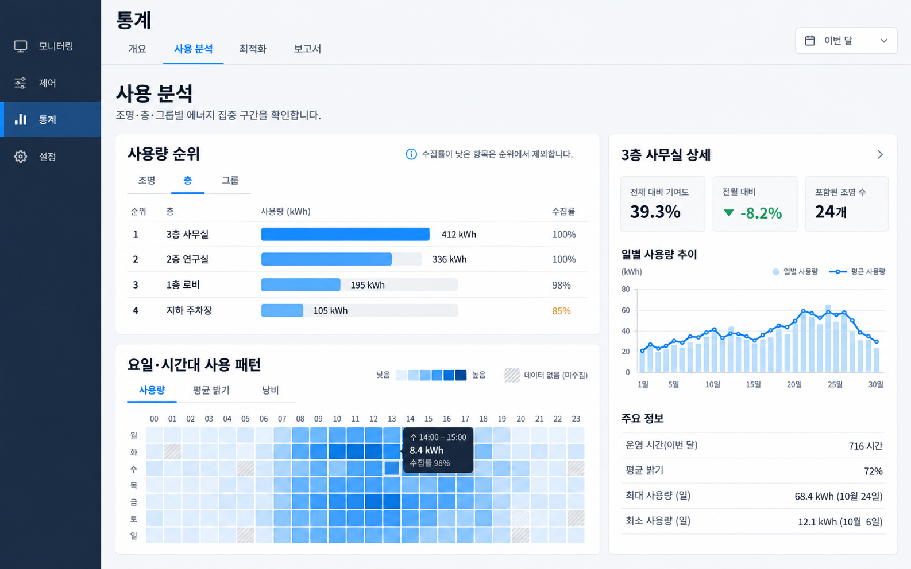
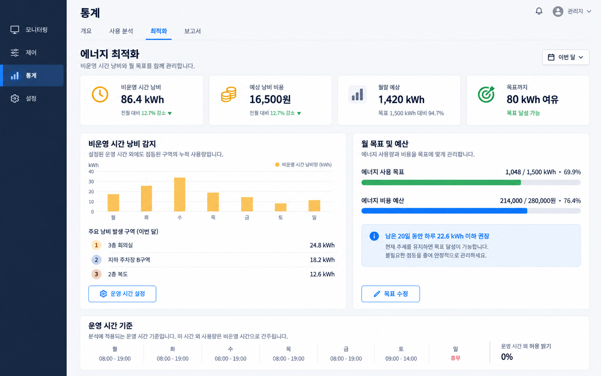
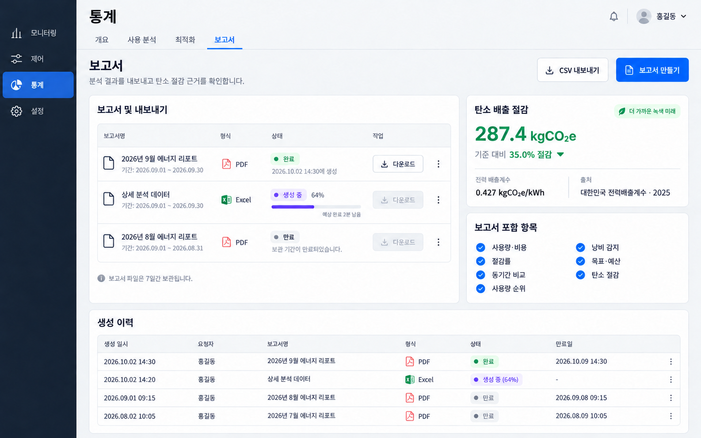

# 통계 분석 P0·P1·P2 기능 확장 설계

작성일: 2026-09-10
상태: 구현 계획 작성 전 검토본
대상 브랜치: `codex/statistics-analytics-plans`
기준 브랜치: `codex/mvp1-cloud-web`

## 1. 문서 목적

현재 통계 페이지의 상태 기반 전력 추정 기능을 사용자가 에너지 절감 성과를 빠르게 이해하고, 낭비 원인을 찾고, 목표를 관리하며, 결과를 보고서로 내보낼 수 있는 분석 제품으로 확장한다.

이 문서는 P0·P1·P2의 기능 정의, 산식, 데이터 계약, 화면 상태, 권한, 보존 정책, 단계별 배포 기준을 하나의 정본으로 고정한다. 구현은 우선순위별로 독립 배포하며 P0부터 순서대로 진행한다.

## 2. 목표와 비목표

### 2.1 목표

- 24시간·100% 밝기 기준 대비 사용량과 절감률을 한 화면에서 설명한다.
- 전월·전년 동기간과 비교해 현재 성과의 방향을 보여준다.
- 조명·층·그룹별 사용량 집중 구간과 비운영 시간 낭비를 찾는다.
- 월 사용량 목표와 비용 예산을 설정하고 월말 예상치를 관리한다.
- 요일·시간대 패턴, CSV·Excel·PDF 보고서, 탄소 절감량을 제공한다.
- 모든 값에 상태 기반 추정 출처와 데이터 수집 품질을 함께 전달한다.
- 각 우선순위가 이전 단계의 API를 깨지 않고 독립적으로 배포·롤백될 수 있게 한다.

### 2.2 비목표

- P3 제어 방식별 절감 기여도는 이번 범위에서 구현하지 않는다.
- 실제 전력계에서 측정한 사용량이라고 표현하지 않는다.
- 일별 데이터로 시간대 데이터를 임의 복원하지 않는다.
- 현재 조명·층·그룹 구성을 과거 전체 기간에 존재했던 것처럼 소급하지 않는다.
- 탄소 절감량을 나무 수, 자동차 주행거리 등 검증되지 않은 등가 표현으로 변환하지 않는다.
- P0·P1·P2 구현만으로 실제 Raspberry Pi·ESP32-H2·전력계 HIL 검증이 완료되었다고 간주하지 않는다.

## 3. 현재 구현 기준선

현재 Web은 `GET /energy/sites/:siteId/summary`와 `GET /energy/sites/:siteId/series`를 사용한다. API는 `FixtureEnergyDailyAggregate`와 열려 있는 `FixtureEnergyStateCursor`를 합쳐 상태 이벤트 기반 사용량을 계산한다.

현재 제공되는 값은 다음과 같다.

- 오늘, 이번 달 누적, 올해 누적 사용량·비용
- 일별·월별 사용량 추이
- 이번 달 예상 사용량·비용
- 현재 등록 조명을 24시간·100% 밝기로 운전한 기준 사용량·비용
- 기준 대비 예상 절감 kWh·비용
- `available`, `partial`, `no_data` 데이터 상태

현재 구조에서 해결해야 할 제약은 다음과 같다.

- 일별 집계가 operational `Fixture`에 `onDelete: Cascade`로 연결되어 조명 삭제 시 분석 이력이 사라진다.
- 조명 이름, 층, 그룹, 정격 W의 유효기간 이력이 없어 과거 순위를 정확히 재구성할 수 없다.
- 시간별 집계가 없어 요일×시간대 패턴과 운영 시간 밖 낭비를 정확히 분석할 수 없다.
- 현재 `EnergyService`가 접근 검증, 원시 데이터 조회, projection, 기간 합산, 응답 조립을 함께 수행한다.
- 기존 summary와 series는 각 요청에서 `generatedAt`을 따로 생성하므로 한 화면의 카드와 차트가 미세하게 다른 시점일 수 있다.
- P3에 필요한 최종 제어 승자 source가 조명 상태 이벤트에 포함되지 않아 기존 실행 로그만으로 절감 기여도를 안전하게 추론할 수 없다.

## 4. 공통 제품 원칙

### 4.1 추정값 표시

모든 통계 화면과 내보내기 문서에는 `상태 기반 추정`을 표시한다. 이 문구는 페이지 헤더, 다운로드 파일의 메타데이터, PDF 각주에 유지한다.

실제 전력계 데이터가 도입되기 전에는 `실측`, `계측 완료`, `검침 사용량` 표현을 사용하지 않는다.

### 4.2 미확인 값 처리

- 데이터 미확인은 `0`이 아니라 `null`과 `no_data` 또는 `partial`로 표현한다.
- 수집 공백을 절감량으로 계산하지 않는다.
- 수집률이 낮은 항목은 낮은 사용량 순위로 노출하지 않는다.
- 차트는 결측 구간을 선으로 연결하지 않고, 표와 히트맵은 별도 패턴으로 표시한다.

### 4.3 데이터 품질

모든 분석 응답은 다음 정보를 포함한다.

- `source`: `state_based_estimate`
- `generatedAt`: 한 응답 스냅샷의 생성 시각
- `timeZone`: 계산에 사용한 IANA timezone
- `knownSeconds`, `unknownSeconds`
- `coverageRate`: `knownSeconds / (knownSeconds + unknownSeconds)`; 분모가 0이면 `null`
- `dataStatus`: `available | partial | no_data`
- 이력 품질이 필요한 응답의 `historyQuality`: `observed | legacy_structure_unknown`

### 4.4 숫자 반올림

- kWh: API 계산은 Decimal로 유지하고 응답에서 소수 넷째 자리까지 반올림한다.
- 비용: 원 단위 응답은 소수 둘째 자리까지 유지하고 Web은 원 단위로 표시한다.
- 비율: API는 `0.35`가 아니라 표시 가능한 퍼센트 값 `35.0`을 반환하되, 산식용 원본 분자·분모도 함께 반환한다.
- 탄소: kgCO₂e는 소수 첫째 자리까지 표시하고 계산은 Decimal 원본 정밀도를 유지한다.

### 4.5 권한과 tenant 격리

- 모든 site-scoped API는 다른 조회보다 먼저 `SiteAccessService.assert(user, siteId, ...)`를 실행한다.
- 통계 조회는 할당된 admin과 viewer가 사용할 수 있다.
- 운영 시간, 월 목표·예산 수정은 할당된 admin만 가능하다.
- 배출계수 카탈로그 수정과 현장 배출계수 지정은 operator만 가능하다.
- 권한이 없는 site, report job, download 요청은 존재 여부를 노출하지 않도록 `404`로 처리한다.

### 4.6 시간대

P0·P1·P2 구현 범위에서는 현장 timezone을 설치 후 불변값으로 취급한다. 변경 기능은 제공하지 않는다.

UTC 저장과 현지 분석을 함께 만족하기 위해 시간별 집계는 `bucketStartUtc`, `localDate`, `localHour`, `utcOffsetMinutes`를 저장한다. DST로 같은 현지 시간이 두 번 발생하면 원시 bucket은 분리 보존하고 화면 cell에서는 실제 known seconds를 합산한다.

## 5. 화면 정보 구조와 간격

### 5.1 통계 서브메뉴와 route

통계는 하나의 긴 페이지가 아니라 사용자 목적에 따른 네 개의 하위 페이지로 구성한다.

| 서브메뉴 | Route | 사용자 목적 | 포함 기능 |
| --- | --- | --- | --- |
| 개요 | `/statistics/overview` | 에너지 성과를 빠르게 파악 | 기존 KPI, P0 절감률, 기준 비교 그래프, 전월·전년 동기간 비교 |
| 사용 분석 | `/statistics/analysis` | 사용량이 집중되는 위치와 시간을 탐색 | P1 조명·층·그룹 순위와 상세 추이, P2 요일×시간대 히트맵 |
| 최적화 | `/statistics/optimization` | 낭비를 줄이고 월 목표를 관리 | P1 비운영 시간 낭비, 운영 시간 정책, 월 목표·예산 |
| 보고서 | `/statistics/reports` | 결과를 공유하고 산출 근거를 확인 | P2 CSV·Excel·PDF, 생성 이력, 탄소 배출·절감량 |

개발 우선순위인 P0·P1·P2를 메뉴명으로 노출하지 않는다. 사용자는 `성과 확인 → 원인 탐색 → 개선 행동 → 공유` 흐름으로 기능을 이해한다.

기존 `/statistics` 진입은 query와 hash를 보존한 채 `/statistics/overview`로 `replace` 이동한다. 예를 들어 `/statistics?siteId=abc`는 `/statistics/overview?siteId=abc`가 된다. 알 수 없는 `/statistics/*` 경로도 사용 가능한 첫 페이지인 개요로 이동한다.

### 5.2 서브메뉴 노출 시점

아직 구현되지 않은 페이지를 disabled tab이나 빈 화면으로 미리 노출하지 않는다.

- P0 배포: `개요`만 노출
- P1 배포: `개요`, `사용 분석`, `최적화` 노출
- P2 배포: `개요`, `사용 분석`, `최적화`, `보고서` 모두 노출

직접 URL로 아직 배포되지 않은 페이지에 접근하면 현재 사용 가능한 첫 페이지로 이동한다. 서버 권한에 따라 메뉴를 숨겨 보안을 대신하지 않으며 각 API의 권한 검증은 그대로 수행한다.

### 5.3 Web 컴포넌트 경계

- `StatisticsShell`: site context와 하위 route의 `Outlet`을 제공한다.
- `StatisticsSubnavigation`: 현재 배포 단계에서 사용 가능한 메뉴만 렌더링한다.
- `StatisticsOverviewPage`: 기존 `StatisticsView`와 P0 기능을 소유한다.
- `StatisticsAnalysisPage`: ranking, drilldown, heatmap을 소유한다.
- `StatisticsOptimizationPage`: waste, operating-hours, monthly target을 소유한다.
- `StatisticsReportsPage`: export, report job, emission 정보를 소유한다.

페이지 전환 시 `siteId` query를 항상 보존한다. 페이지별 기간·차원 filter는 URL query로 직렬화해 새로고침, 뒤로 가기, 링크 공유 후에도 복원한다. 다른 페이지에 의미가 없는 filter는 전달하지 않고 `siteId`만 유지한다.

### 5.4 탐색 동작과 접근성

- 데스크톱은 콘텐츠 상단에 현재 배포된 서브메뉴의 수평 `NavLink`를 표시하며 P2 최종 상태에서는 네 개가 된다.
- 활성 페이지는 색상뿐 아니라 underline과 `aria-current="page"`로 구분한다.
- 모바일은 메뉴 label을 줄이지 않고 내부 가로 스크롤 영역을 사용한다. document 전체의 가로 overflow는 허용하지 않는다.
- route가 바뀌면 새 페이지의 `h2`로 focus를 옮기지 않는다. 브라우저 기본 탐색 흐름을 유지하고 문서 제목과 `h1`/`h2` 구조만 정확히 갱신한다.
- 키보드 Tab으로 각 link에 접근하며 좌우 화살표 전용 tab widget으로 만들지 않는다. 각 항목은 독립적인 페이지 link다.
- primary sidebar의 `통계`는 모든 `/statistics/*` route에서 active 상태를 유지하고 기본 목적지는 `/statistics/overview`다.

### 5.5 공통 간격

현재 통계 페이지에 적용된 4px 배수 간격 규칙을 유지한다.

- 페이지 상단부터 콘텐츠를 배치하고 세로 중앙 정렬을 사용하지 않는다.
- 페이지 섹션 간격: 24px
- 같은 섹션의 카드 간격: 16px
- 카드 내부 주요 그룹 간격: 16px
- 라벨·값·보조 설명 간격: 4px 또는 8px
- 데스크톱 카드 padding: 24px
- 760px 이하 카드 padding: 16px
- 1120px 초과는 12-column grid, 그 이하는 한 열 또는 두 열로 재배치한다.
- 모든 버튼과 탭은 모바일에서 최소 44×44px hit area를 유지한다.

서브메뉴 아래 페이지 상단에는 현장, 기간, 추정 출처, 마지막 집계 시각을 배치한다. 사용자가 기간을 바꾸면 같은 `generatedAt` 기준으로 해당 페이지의 KPI, 차트, 비교, 상세 목록을 함께 갱신한다.

## 6. P0 — 절감 성과와 기준 비교

### 6.1 사용자 질문

P0는 다음 질문에 즉시 답해야 한다.

- 이번 달 에너지를 얼마나 사용할 것으로 예상하는가?
- 24시간·100% 밝기 기준보다 몇 kWh, 몇 원, 몇 % 줄였는가?
- 기준보다 더 사용하고 있다면 얼마나 초과했는가?
- 전월·전년 같은 기간보다 좋아졌는가?
- 이 결론을 믿을 수 있을 만큼 데이터가 수집되었는가?

### 6.2 P0 화면 예시



예시 이미지는 정보 구조와 시각 우선순위를 설명한다. 표시 숫자는 예시 데이터이며 구현의 산식과 상태 규칙은 이 문서가 우선한다.

### 6.3 기능 P0-1: 기준 대비 에너지 절감률

#### 표시 내용

- `이번 달 예상 사용량`
- `24시간 100% 기준`
- `에너지 절감률`
- `예상 절감 비용`
- 데이터 수집률과 forecast 사용 가능 여부

#### 기준 사용량

선택 기간의 각 현지 날짜에 대해 다음을 합산한다.

```text
일 기준 kWh = Σ(현재 등록 조명 정격 W × 현지 날짜의 실제 초) / 3,600,000
기간 기준 kWh = Σ(일 기준 kWh)
```

Asia/Seoul은 통상 하루 24시간이지만 IANA timezone 규칙상 23시간·25시간 날짜도 정확히 계산한다.

P0는 기존 데이터만 사용하므로 과거 날짜에도 현재 등록 조명과 현재 정격 W를 적용한다. 화면과 보고서에는 `현재 등록 조명 기준`을 표시한다. P1 이력 모델 활성화 이후부터는 해당 날짜에 유효한 정격 W와 소속을 사용한다.

#### 예상 사용량

현재 월 forecast는 다음 조건을 그대로 유지한다.

- 각 조명별 월 known time이 최소 1시간 이상이어야 한다.
- 현장 전체 eligible time 대비 known time 수집률이 80% 이상이어야 한다.
- 등록 조명이 없거나 조건을 만족하지 못하면 forecast는 `null`이다.

월말 예상은 관측된 사용량에 조명별 관측 평균 소비율을 남은 기간에 projection한 값을 더한다. 미래 날짜의 차트 점도 같은 평균 소비율을 날짜별 실제 초에 적용한다.

#### 절감 산식

```text
절감 kWh = 기준 kWh - 실제 또는 예상 kWh
절감 비용 = 절감 kWh × 현장 현재 kWh 단가
절감률(%) = (절감 kWh / 기준 kWh) × 100
```

- 결과가 음수이면 0으로 보정하지 않고 `기준 대비 초과 사용`으로 표시한다.
- 기준 사용량이 0이면 절감률은 `null`이다.
- forecast가 불가능하면 예상 절감 kWh·비용·절감률은 모두 `null`이다.
- 음수일 때 색상만으로 의미를 전달하지 않고 `초과` 텍스트와 아이콘을 함께 사용한다.

### 6.4 기능 P0-2: 기준 사용량과 실제·예상 사용량 비교 그래프

#### 기간 preset

- 최근 7일: 어제까지 완료된 최근 7개 현지 날짜
- 이번 달: 현지 월 1일부터 월말까지, 오늘 이후는 forecast
- 올해: 현지 연 1월 1일부터 어제까지 완료된 날짜를 월별로 합산하며 미래 월 forecast는 제공하지 않음

P0에서는 사용자 임의 날짜 범위를 제공하지 않는다. 우선 preset의 산식·빈 상태·반응형 UI를 안정화한다.

최근 7일과 올해 summary는 완료된 날짜의 실제 상태 기반 추정값을 기준과 비교하고 `forecastReason=not_applicable`을 반환한다. 이번 달 summary만 월말 forecast와 월 전체 baseline을 비교한다.

#### series 구성

각 point는 다음을 제공한다.

- `period`
- `baselineKwh`
- `estimatedKwh`
- `phase`: `observed | forecast | unavailable`
- `knownSeconds`, `unknownSeconds`, `coverageRate`, `dataStatus`

월간 그래프는 기준을 중립색 bar, 실제를 실선, 예상 구간을 점선으로 표현한다. `estimatedKwh=null`인 point는 0축에 찍지 않는다.

tooltip은 기간, 기준 kWh, 실제/예상 kWh, 차이 kWh, 차이 %, 수집률을 표시한다.

### 6.5 기능 P0-3: 전월·전년 동기간 비교

비교는 완료된 현지 날짜만 사용한다. 오늘 진행 중인 사용량을 완료된 과거 날짜와 비교하지 않는다.

예를 들어 2026-09-10에 화면을 열면 다음을 비교한다.

- 현재: 2026-09-01 00:00부터 2026-09-10 00:00 직전
- 전월: 2026-08-01 00:00부터 2026-08-10 00:00 직전
- 전년: 2025-09-01 00:00부터 2025-09-10 00:00 직전

2월 29일이 비교 연도에 없으면 그 해 2월 마지막 날에서 범위를 끝낸다.

```text
변화율(%) = ((현재 동기간 kWh - 비교 동기간 kWh) / 비교 동기간 kWh) × 100
```

- 음수 변화율은 사용량 감소, 양수는 증가다.
- 비교 기간 사용량이 0 또는 `null`이면 변화율은 `null`이다.
- 두 기간 모두 수집률을 표시한다.
- P0에서는 과거 조명 구성 변화 보정이 없으므로 `조명 구성 변화 미보정`을 표시한다.

### 6.6 P0 API

기존 summary와 series 응답은 변경하지 않는다. 다음 additive endpoint를 추가한다.

```http
GET /energy/sites/:siteId/comparisons?preset=last_7_days|current_month|current_year
```

응답 최상위 구조는 다음과 같다.

```ts
interface EnergyComparisonResponse {
  siteId: string;
  timeZone: string;
  source: "state_based_estimate";
  generatedAt: string;
  preset: "last_7_days" | "current_month" | "current_year";
  range: { from: string; to: string; completedThrough: string };
  summary: {
    baselineKwh: number;
    estimatedKwh: number | null;
    savingsKwh: number | null;
    savingsCost: number | null;
    savingsRatePercent: number | null;
    outcome: "saving" | "overuse" | "unavailable";
    forecastReason: "available" | "insufficient_state" | "no_registered_fixture" | "not_applicable";
  };
  priorComparisons: Array<{
    kind: "previous_period" | "previous_year";
    currentRange: { from: string; to: string };
    comparisonRange: { from: string; to: string };
    currentKwh: number | null;
    comparisonKwh: number | null;
    changeRatePercent: number | null;
    currentCoverageRate: number | null;
    comparisonCoverageRate: number | null;
    historyQuality: "legacy_structure_unknown";
  }>;
  points: EnergyComparisonPoint[];
}
```

새 shared Zod schema는 `.strict()`를 사용하며 Web은 API boundary에서 parse한다.

### 6.7 P0 실패·빈 상태

- 등록 조명 없음: 기준과 forecast 대신 등록 안내를 표시한다.
- 수집 1시간 미만 또는 수집률 80% 미만: forecast와 절감률을 숨기고 부족한 조건을 구체적으로 표시한다.
- 과거 비교 데이터 없음: 해당 비교 카드만 `비교할 데이터 없음` 상태로 둔다.
- 일부 일자 공백: 점을 `null`로 유지하고 상단에 수집 공백 notice를 표시한다.
- tariff 미설정: 설치 완료 전 현장의 기존 계약대로 409를 유지한다. summary의 non-null 비용 계약은 P0에서 변경하지 않는다.

### 6.8 P0 완료 기준

- 양수·0·음수 절감률 산식이 Decimal 기준 테스트를 통과한다.
- forecast 불가 조건에서 절감값을 노출하지 않는다.
- 오늘을 제외한 전월·전년 동기간 경계와 leap day가 테스트된다.
- 1440, 1024, 390, 320 viewport에서 가로 overflow와 차트 label 충돌이 없다.
- 키보드로 기간 preset을 이동·선택할 수 있고 차트 데이터가 접근 가능한 목록으로 제공된다.
- 기존 summary·series consumer 테스트가 수정 없이 통과한다.

## 7. P1 — 원인 분석과 목표 관리

### 7.1 사용자 질문

P1은 다음 질문에 답해야 한다.

- 어느 조명, 층, 그룹이 가장 많은 에너지를 사용하는가?
- 운영하지 않는 시간에 켜져 낭비된 구역은 어디인가?
- 이번 달 목표와 예산 안에 들어오는가?
- 목표를 달성하려면 남은 기간에 하루 평균 얼마나 줄여야 하는가?

### 7.2 P1 화면 예시와 페이지 배치

P1 기능은 한 페이지에 섞지 않고 탐색 목적과 관리 목적에 따라 나눈다.



`사용 분석`은 사용량 순위와 선택 항목의 상세 추이를 제공한다. P2 배포 후 같은 페이지 아래에 요일×시간대 히트맵이 추가된다.



`최적화`는 비운영 시간 낭비, 분석용 운영 시간 정책, 월 목표·예산을 하나의 행동 흐름으로 제공한다.

### 7.3 P1 선행 기반: 분석용 조명 정체성과 이력

Operational `Fixture` 생명주기와 분석 이력을 분리한다.

#### `EnergyFixtureIdentity`

- 영구적인 분석 조명 ID
- `siteId`
- 현재 operational fixture와 nullable 1:1 연결
- `trackingStartedAt`, `retiredAt`
- operational fixture 삭제 시 연결만 끊고 분석 row와 집계를 보존

#### `EnergyFixtureDimensionVersion`

- `energyFixtureId`
- `effectiveFrom`, `effectiveTo`
- 조명 이름 snapshot
- floor identity와 floor name snapshot
- 정격 W
- `historyQuality`: `observed | legacy_structure_unknown`

조명 이름, 층, 정격 W가 바뀌면 기존 version의 `effectiveTo`를 닫고 새 version을 같은 transaction에서 생성한다.

#### 그룹 이력

- `EnergyGroupIdentity`: site 안에서 영구적인 분석 그룹 ID와 operational group nullable 연결
- `EnergyGroupDimensionVersion`: 그룹 이름과 유효기간
- `EnergyGroupMembershipVersion`: 조명-그룹 소속과 유효기간

그룹은 서로 겹칠 수 있으므로 그룹 순위 합계가 현장 합계와 같다고 표현하지 않는다. UI에 `복수 소속 포함`을 표시한다.

#### 기존 데이터 migration

현재 Fixture마다 identity와 migration 활성 시각부터 시작하는 dimension version을 생성한다. 기존 일별 집계는 새 identity FK로 backfill하되 migration 활성 시각 이전 집계에는 dimension을 연결하지 않는다.

과거 이름·층·그룹 이력을 추정 생성하지 않는다. migration 이전 기간이 포함되면 site 합계는 유지하되 `legacy_structure_unknown`을 표시하고 조명·층·그룹 순위는 분석 이력이 시작된 날짜 이후만 제공한다. Web은 `분석 기준 적용 전 데이터는 순위에서 제외됨`을 표시한다.

`FixtureEnergyDailyAggregate`의 cascade FK를 분석 identity FK로 교체한다. DB 구조 변경과 같은 작업에서 `docs/database-schema.md`를 갱신한다.

### 7.4 P1 선행 기반: 시간별 집계

`FixtureEnergyHourlyAggregate`를 추가한다.

```text
energyFixtureId
bucketStartUtc
localDate
localHour
utcOffsetMinutes
estimatedKwh
estimatedCost
knownSeconds
unknownSeconds
brightnessWeightedSeconds
createdAt
updatedAt
```

고유키는 `(energyFixtureId, bucketStartUtc)`다. `brightnessWeightedSeconds`는 각 상태 구간의 `brightnessPercent × seconds` 합계이며 평균 밝기는 이를 known seconds로 나눠 계산한다.

상태 이벤트 ingest transaction은 processed event ledger, 일별 집계, 시간별 집계, cursor, fixture 상태를 원자적으로 갱신한다. 같은 이벤트 replay가 일별 또는 시간별 집계를 중복 증가시키지 않아야 한다.

시간별 분석은 migration 배포 시점 이후 데이터만 제공한다. 일별 데이터를 24개 시간 bucket으로 나누는 backfill은 하지 않는다.

### 7.5 기능 P1-1: 조명·층·그룹별 사용량 순위

#### 조회 조건

- 차원: `fixture | floor | group`
- 기간: 최근 7일, 이번 달, 올해
- 지표: 사용량, 비용, 현장 사용량 기여율, 조명당 평균
- 정렬: 내림차순 기본, 오름차순 선택
- 기본 10개, 최대 100개

#### 순위 row

- 분석 identity와 표시 이름
- 순위
- 사용량 kWh, 비용
- 현장 사용량 대비 기여율
- 포함 조명 수
- known/unknown seconds와 수집률
- history quality
- 이전 동기간 순위 또는 사용량 변화

수집률이 정책 기준보다 낮은 row는 순위를 부여하지 않고 `수집 부족` 구역으로 분리한다. 사용량 0과 데이터 없음은 서로 다른 상태다.

row 선택 시 해당 차원의 일별 추이와 포함 조명 breakdown을 side panel로 연다.

```http
GET /energy/sites/:siteId/rankings?dimension=fixture|floor|group&from=YYYY-MM-DD&to=YYYY-MM-DD&metric=usage|cost|contribution|per_fixture_average&sort=desc|asc&limit=10
```

API는 집계 table과 유효기간 dimension을 SQL에서 결합하고 전체 fixture를 메모리에 적재해 정렬하지 않는다.

### 7.6 기능 P1-2: 비운영 시간 낭비 감지

조명 제어용 `LightingSchedule`과 분석용 운영 시간은 목적이 다르므로 공유하지 않는다. 운영 시간 정책은 `SiteOperatingHoursPolicy`로 별도 관리한다.

#### 운영 시간 정책

- 요일별 시작·종료 시각
- 휴무 요일
- 날짜별 휴일·임시 운영 예외
- 비운영 시간 허용 밝기(%), 기본 0%
- 유효기간 version
- 작성자와 변경 시각

초기 UI는 정각 단위로 설정한다. 자정을 넘는 운영 시간도 지원한다.

#### 낭비 산식

유효한 운영 시간 정책과 시간별 상태 구간을 교차한다.

```text
낭비 밝기 = max(관측 평균 밝기 - 허용 밝기, 0)
낭비 kWh = 정격 W × 낭비 밝기/100 × known seconds / 3,600,000
낭비 비용 = 낭비 kWh × 해당 집계의 비용 단가
```

- unknown seconds는 낭비나 절감으로 계산하지 않는다.
- 정책이 없는 현장은 낭비를 0으로 표시하지 않고 `운영 시간 설정 필요`로 표시한다.
- 운영 시간 정책 변경은 effective-dated version으로 과거 분석 의미를 보존한다.
- 7일의 시간별 데이터가 쌓이기 전에는 주간 낭비 순위를 활성화하지 않는다.

```http
GET /energy/sites/:siteId/waste?from=YYYY-MM-DD&to=YYYY-MM-DD&dimension=fixture|floor|group
GET /energy/sites/:siteId/operating-hours
PUT /energy/sites/:siteId/operating-hours
```

### 7.7 기능 P1-3: 월 목표와 예산 관리

`EnergyMonthlyTarget`은 site와 현지 월마다 최대 1개다.

```text
id
siteId
localMonth (YYYY-MM의 첫 날짜)
targetKwh nullable
budgetAmount nullable
createdByUserId
updatedByUserId
createdAt
updatedAt
```

목표 사용량과 예산 중 하나 이상을 입력해야 한다. 0 이하 값은 허용하지 않는다.

#### 표시 값

- 이번 달 누적 사용량·비용
- 월말 예상 사용량·비용
- 목표 대비 누적 진행률
- 예상 목표 초과 또는 여유량
- 남은 완료 가능 일수
- 목표 달성을 위해 남은 기간에 허용되는 하루 평균 kWh
- 현재 추세가 목표 안인지 `여유 | 주의 | 초과 예상 | 예측 불가` 상태

```text
남은 허용 kWh = max(목표 kWh - 현재 누적 kWh, 0)
일 허용 사용량 = 남은 허용 kWh / 남은 현지 날짜 수
```

forecast가 불가능하면 `목표 달성 예상`을 주장하지 않고 현재 누적과 남은 허용량만 표시한다.

```http
GET /energy/sites/:siteId/targets/:month
PUT /energy/sites/:siteId/targets/:month
DELETE /energy/sites/:siteId/targets/:month
```

### 7.8 P1 화면 상태

- 이력 migration 전 데이터: `과거 구조 미확인` badge와 설명
- 시간별 데이터 7일 미만: 남은 수집 기간을 날짜 기준으로 안내
- 운영 시간 미설정: 설정 CTA, 낭비값 없음
- 목표 미설정: viewer는 empty state, admin은 설정 CTA
- 목표 초과: 색상과 함께 초과 예상 kWh·원 텍스트 제공
- 그룹 복수 소속: 합계가 현장 합계와 다를 수 있다는 설명 제공

### 7.9 P1 구현 순서와 완료 기준

1. 분석 identity·dimension·membership history migration
2. 일별 집계 FK 전환과 삭제 보존 회귀
3. 시간별 집계와 원자적 ingest
4. 순위 API와 UI
5. 운영 시간 정책 CRUD
6. 낭비 분석 API와 UI
7. 월 목표·예산 CRUD와 UI

완료 기준은 다음과 같다.

- 조명 삭제·이름 변경·층 이동·정격 W 변경 후 과거 집계가 보존된다.
- 그룹 중복 소속이 현장 합계로 오인되지 않는다.
- DST 중복 시간과 누락 시간이 실제 초 기준으로 집계된다.
- replay와 transaction rollback에서 일별·시간별 값이 함께 원복된다.
- admin mutation과 viewer read-only 권한이 API와 Web 모두에서 검증된다.
- 시간별 데이터가 부족한 상황에서 낭비값을 생성하지 않는다.

## 8. P2 — 패턴 분석, 보고서, 탄소 절감

### 8.1 사용자 질문

P2는 다음 질문에 답해야 한다.

- 어느 요일과 시간대에 사용량 또는 낭비가 집중되는가?
- 화면에서 본 분석을 CSV·Excel·PDF로 공유할 수 있는가?
- 절감한 에너지가 몇 kgCO₂e의 배출 저감에 해당하는가?
- 보고서에 사용한 배출계수와 데이터 시점을 다시 확인할 수 있는가?

### 8.2 P2 화면 예시와 페이지 배치

P2 히트맵은 기존 `사용 분석` 페이지를 확장하고, 외부 공유와 탄소 근거는 새 `보고서` 페이지에서 제공한다.




### 8.3 기능 P2-1: 요일×시간대 히트맵

#### 기본 조회

- 기본 기간: 오늘 이전 완료된 최근 4주
- 최대 기간: 92일
- 행: 월요일부터 일요일까지 7개
- 열: 현지 시간 0시부터 23시까지 24개
- 지표: `energy | brightness | waste`

#### cell 값

- 사용량 kWh 합계
- 시간 가중 평균 밝기
- 비운영 시간 낭비 kWh
- known/unknown seconds와 수집률
- 포함된 실제 UTC bucket 수

평균 밝기는 단순 bucket 평균이 아니라 `Σ brightnessWeightedSeconds / Σ knownSeconds`로 계산한다.

결측 cell은 0 사용 cell과 다른 hatch 또는 중립 패턴으로 표시한다. 색상만으로 값 범위를 구분하지 않도록 범례와 tooltip 숫자를 제공한다.

DST로 같은 현지 요일·시간이 두 번 발생하면 두 UTC bucket을 같은 cell에 합산하되 실제 known seconds를 유지한다.

```http
GET /energy/sites/:siteId/heatmap?from=YYYY-MM-DD&to=YYYY-MM-DD&metric=energy|brightness|waste
```

### 8.4 기능 P2-2: CSV·Excel·PDF 보고서

#### CSV

현재 선택한 기간·필터·차원의 상세 데이터를 즉시 내려받는다.

- UTF-8 BOM을 포함해 한글 Excel 호환성을 확보한다.
- 파일 첫 행 또는 별도 metadata block에 현장, timezone, 생성 시각, 추정 출처, 수집률을 포함한다.
- CSV cell formula injection을 막기 위해 `=`, `+`, `-`, `@`로 시작하는 사용자 입력 label을 안전하게 escape한다.

#### Excel·PDF

생성 시간이 길고 결과를 재현해야 하므로 `EnergyReportJob` 기반 비동기 작업으로 처리한다.

```text
id
siteId
requestedByUserId
format (xlsx | pdf)
status (queued | processing | completed | failed | expired)
progressPercent
requestSnapshot JSON
dataSnapshot JSON nullable
objectKey nullable
contentSha256 nullable
attemptCount
leaseOwner nullable
leaseExpiresAt nullable
errorCode nullable
createdAt
startedAt nullable
completedAt nullable
expiresAt
```

API 프로세스의 durable worker는 DB row를 `FOR UPDATE SKIP LOCKED` 방식으로 claim하고 lease를 갱신한다. 별도 in-memory queue만 사용하지 않는다. 프로세스가 종료되면 lease 만료 후 다른 worker가 재개한다.

보고서 숫자는 생성 중 재조회로 바뀌지 않도록 최초 claim 시 `generatedAt`과 분석 결과 snapshot을 저장한다. 화면과 동일한 `EnergyAnalyticsQueryService`를 사용해 산식 중복을 만들지 않는다.

보고서에는 다음 항목을 포함한다.

- 사용량·비용과 데이터 품질
- 기준 사용량·절감률
- 전월·전년 동기간 비교
- 조명·층·그룹 순위
- 비운영 시간 낭비
- 월 목표·예산
- 요일×시간대 히트맵
- 탄소 사용·절감량과 배출계수 출처

PDF는 저장소에 포함된 재배포 가능한 한글 font를 사용한다. 배포 전 font license를 문서화하고 production image에 포함되는지 검증한다.

완료 파일은 private object storage에 7일간 보관한다. download URL은 요청 시 생성하고 5분 후 만료한다. job metadata는 90일 보관하고 이후 제거한다.

```http
POST /energy/sites/:siteId/reports
GET /energy/sites/:siteId/reports
GET /energy/sites/:siteId/reports/:reportId
POST /energy/sites/:siteId/reports/:reportId/download
```

동일 site·사용자·request snapshot의 queued 또는 processing job이 있으면 중복 job을 만들지 않고 기존 job을 반환한다.

### 8.5 기능 P2-3: 탄소 배출과 절감량

#### 배출계수 모델

`EmissionFactorCatalog`

- 지역 또는 전력망 코드
- factor kgCO₂e/kWh
- 출처 기관과 문서명
- version
- effectiveFrom, effectiveTo
- operator 승인자와 승인 시각

`SiteEmissionFactorAssignment`

- siteId
- emissionFactorId
- effectiveFrom, effectiveTo

한 site의 유효기간이 겹치는 assignment는 DB constraint와 service 검증으로 거부한다.

#### 산식

```text
배출량 kgCO₂e = 상태 기반 추정 사용량 kWh × 유효 배출계수
절감량 kgCO₂e = 기준 대비 절감 kWh × 유효 배출계수
```

절감 kWh가 음수이면 탄소도 `절감`으로 표시하지 않고 `기준 대비 추가 배출`로 표시한다.

기간에 여러 배출계수 version이 걸치면 날짜별 유효 계수로 계산한 뒤 합산한다. 배출계수가 없거나 유효기간이 겹치면 계산하지 않고 `배출계수 설정 필요` 상태를 반환한다.

화면과 보고서는 factor 값, 단위, 출처, version, 유효기간을 표시한다. 보고서 snapshot에는 이 정보를 영구 포함해 카탈로그가 변경되어도 과거 보고서의 근거가 바뀌지 않게 한다.

```http
GET /energy/sites/:siteId/emissions?from=YYYY-MM-DD&to=YYYY-MM-DD
GET /operator/emission-factors
POST /operator/emission-factors
PUT /operator/emission-factors/:factorId
GET /operator/sites/:siteId/emission-factor
PUT /operator/sites/:siteId/emission-factor
```

### 8.6 P2 구현 순서와 완료 기준

1. 시간별 집계를 재사용하는 히트맵 query와 UI
2. 동일 filter의 즉시 CSV export
3. `EnergyReportJob`, worker lease, private storage, Excel generator
4. 한글 font와 PDF generator
5. 배출계수 카탈로그·현장 지정·유효기간 계산
6. 탄소 카드와 보고서 포함

완료 기준은 다음과 같다.

- 7×24 cell, 결측/0 구분, DST 합산, 92일 제한이 검증된다.
- CSV injection 방어와 한글 Excel 열기가 검증된다.
- report worker 중단·lease expiry·retry에서도 job이 중복 완료되지 않는다.
- 다른 tenant가 report 상태나 download URL을 조회할 수 없다.
- object는 7일 후 삭제되고 5분 URL 만료가 검증된다.
- PDF의 한글, 표, 차트가 render 결과에서 잘리지 않는다.
- 배출계수 없음·중복·version 경계와 음수 절감이 검증된다.

## 9. 공통 백엔드 구조

### 9.1 `EnergyAnalyticsQueryService`

기존 `EnergyService`에서 다음 read model 책임을 분리한다.

- site와 기간 경계 조회
- closed aggregate와 open cursor projection 결합
- 공통 period 합산과 coverage 계산
- baseline 계산
- forecast 계산
- prior comparison
- ranking, waste, heatmap, emission query
- report snapshot 조립

`EnergyService`는 기존 summary·series 호환 facade와 mutation orchestration을 유지한다.

### 9.2 일관된 화면 snapshot

한 화면의 여러 분석을 `generatedAt` 하나로 계산한다. API는 read-only `RepeatableRead` transaction 안에서 site access 이후 분석 데이터를 읽고 `generatedAt`을 응답에 포함한다.

Web은 같은 화면 scope의 query key에 `siteId`, filter, `generatedAt generation`을 포함한다. 필터 변경 중에는 이전 데이터와 새 데이터를 섞지 않는다.

### 9.3 additive 계약

기존 summary와 series endpoint는 P0·P1·P2 동안 유지한다. 신규 기능은 신규 endpoint와 신규 strict shared schema로 추가한다. 기존 endpoint 제거 또는 필드 의미 변경은 별도 deprecation 계획 없이는 수행하지 않는다.

## 10. 저장·보존·삭제 정책

- 일별 집계: site 생명주기 동안 보존
- dimension·membership·운영시간·배출계수 이력: site 생명주기 동안 보존
- 시간별 집계: 24개월 rolling 보존
- report object: 완료 후 7일
- report job metadata: 생성 후 90일
- site 영구 삭제: 관련 분석 identity, 집계, target, 정책, report object와 metadata를 모두 삭제

Site 삭제 작업은 미완료 report job을 먼저 취소하고 아직 유효한 signed URL 최대 수명을 기다리는 기존 object cleanup 원칙과 일치시킨다.

## 11. 오류 처리와 관측성

### 11.1 사용자 오류 상태

- `insufficient_state`: 수집 시간과 수집률 조건 안내
- `no_registered_fixture`: 조명 등록 안내
- `tariff_unavailable`: 비용만 설정 필요 상태
- `operating_hours_unavailable`: 운영 시간 설정 안내
- `hourly_history_insufficient`: 분석 가능 시작일 안내
- `emission_factor_unavailable`: operator 설정 필요 안내
- `report_generation_failed`: 재시도 가능 여부와 실패 코드 안내
- `report_expired`: 새 보고서 생성 CTA

### 11.2 로그와 지표

- endpoint별 latency와 조회 기간
- comparison/ranking/heatmap result row 수
- 평균 coverage와 forecast 불가 사유 count
- hourly aggregation lag
- report queued time, generation duration, retry, failure, expired object cleanup
- emission factor missing site count

로그에는 사용자 입력 label, report filter를 구조화하되 session, signed URL, object storage credential을 기록하지 않는다.

## 12. 테스트 전략

### 12.1 Shared

- 모든 신규 schema의 valid/invalid fixture
- strict unknown field 거부
- 날짜, enum, nullable 상태, 음수 절감 계약
- API와 Web이 같은 exported type을 사용하는 package export smoke

### 12.2 API unit

- Decimal 산식과 반올림
- 완료 날짜 경계, 월말, 연말, leap day, DST
- null과 0 분리
- coverage threshold 80% 경계
- 조명별 최소 1시간 경계
- effective-dated dimension, policy, emission factor 선택
- group 중복 소속
- report job 상태 전이와 lease

### 12.3 API integration

- migration backfill과 FK 전환
- operational fixture 삭제 후 분석 이력 보존
- event replay와 daily/hourly 원자성
- tenant 404와 role 권한
- `SKIP LOCKED` report claim
- object storage upload/download/expiry cleanup

### 12.4 Web unit

- `/statistics`의 overview redirect와 query·hash 보존
- 모든 `/statistics/*`에서 primary 통계 메뉴 active 유지
- 배포 단계별 서브메뉴 노출과 미배포 route fallback
- 페이지 전환 시 `siteId` 보존과 페이지 전용 filter 분리
- loading, empty, partial, error, unavailable, overuse 상태
- filter와 query key
- keyboard link navigation과 페이지 내부 segmented control
- 차트·표의 accessible name과 수치 대체 콘텐츠
- viewer read-only와 admin CTA
- report polling과 만료 상태

### 12.5 Browser E2E

- 1440×900, 1024×768, 390×844, 320×740
- document-level horizontal overflow 없음
- 네 서브메뉴 직접 URL, 새로고침, 뒤로 가기, primary active 상태
- 모바일 서브메뉴 내부 scroll과 44×44px link target
- P0 기간 전환과 음수 절감
- P1 ranking drilldown, 운영 시간, 목표 CRUD
- P2 heatmap tooltip, CSV, report 생성·완료·download
- keyboard-only 핵심 흐름과 44×44px usable target

### 12.6 보고서 시각 검증

- 생성한 PDF를 page image로 render해 한글 glyph, 표 잘림, page break, chart legend를 확인한다.
- Excel은 formula, numeric cell type, date/timezone metadata, sheet name을 자동 검증한다.

## 13. 배포와 rollback

### 13.1 P0

- DB migration 없음
- `StatisticsShell`, `StatisticsSubnavigation`, `/statistics/overview`를 먼저 배포
- 기존 `/statistics`는 query·hash를 보존해 overview로 이동
- 신규 comparison endpoint와 개요 UI를 feature flag로 배포
- P1·P2 서브메뉴와 route는 노출하지 않음
- coverage/forecast/negative savings telemetry 확인 후 기본 활성화
- rollback은 Web flag 비활성화와 신규 endpoint 미사용으로 수행

### 13.2 P1

- 1차 배포: identity/history/hourly schema와 dual-write
- migration backfill과 검증 query 완료 후 신규 read model 활성화
- `사용 분석`과 `최적화` 서브메뉴·route를 함께 추가
- 시간별 데이터 7일 축적 전 사용 분석의 ranking은 활성화하고 최적화의 waste는 수집 대기 상태로 표시
- rollback 시 dual-write는 유지하고 신규 UI만 비활성화해 이력 손실을 막는다.

### 13.3 P2

- 사용 분석 페이지에 heatmap을 추가하고 `보고서` 서브메뉴·route를 활성화
- heatmap과 CSV를 먼저 활성화
- private storage, cleanup, worker recovery 검증 후 Excel/PDF 활성화
- 승인된 emission factor가 지정된 site만 탄소 카드 활성화
- report generator rollback은 신규 job 생성만 막고 기존 completed file download와 cleanup은 유지

## 14. 구현 우선순위 의존성

```text
P0 비교 query/UI
  └─ 공통 baseline·forecast·coverage 규칙 고정

P1 분석 identity/history + hourly aggregate
  ├─ ranking
  ├─ operating-hours policy → waste
  └─ monthly target/budget

P2 hourly aggregate 재사용 → heatmap
  ├─ shared analytics snapshot → CSV/Excel/PDF
  └─ P0 baseline savings + emission factor → carbon savings
```

P0는 기존 데이터로 먼저 가치를 제공한다. P1은 이후 분석 정확도와 시간 해상도를 확장한다. P2는 P0·P1의 산식과 집계를 재사용해 시각화·외부 공유·탄소 지표를 제공한다.

## 15. P3 보류 조건

제어 방식별 절감 기여도는 다음 telemetry가 별도로 설계될 때까지 보류한다.

- 각 상태 구간에 적용된 최종 winning source
- source priority와 arbitration 결과
- 시작·종료·override 관계
- 재시작과 offline 실행 후에도 보존되는 ordered source history

기존 `AutomationExecution` 또는 command log를 실제 적용 시간으로 간주해 P3 값을 만들지 않는다.

## 16. 계획 문서 전환 기준

이 설계가 승인되면 다음 세 구현 계획을 각각 작성한다.

- P0 절감률·기준 그래프·동기간 비교 구현 계획
- P1 분석 이력·순위·낭비·목표 구현 계획
- P2 히트맵·보고서·탄소 구현 계획

각 계획은 수정할 정확한 파일, 신규 schema와 interface, migration 순서, RED/GREEN 테스트, 2~5분 단위 체크리스트, 단계별 검증 명령, 커밋 경계를 포함한다. 구현은 P0 계획부터 시작하며 P3는 계획 문서에 포함하지 않는다.

세 계획 모두 네 페이지 최종 정보 구조를 공유한다. P0 계획은 shell과 overview 호환 route를 만들고, P1 계획은 analysis·optimization 페이지를 추가하며, P2 계획은 analysis에 heatmap을 확장하고 reports 페이지를 추가한다.
